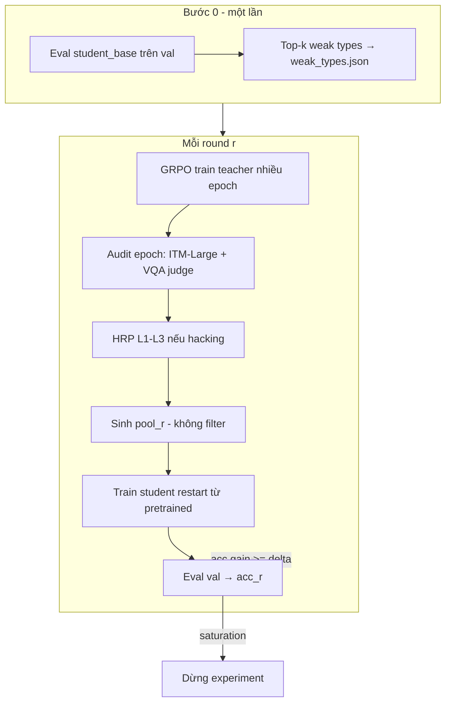

# Hướng dẫn training C-RL: Giải thích toàn bộ quy trình (cho sinh viên AI)

Tài liệu này mô tả **những gì chúng ta sẽ làm** khi chạy thí nghiệm **C-RL** (Reinforcement Learning cho teacher) trên dự án SelTDA. Mọi **từ khóa** được giải thích ngắn gọn, giả định bạn đã học machine learning cơ bản (loss, gradient, fine-tuning) nhưng chưa chuyên sâu VQA hay RL.

**Tài liệu tham chiếu kỹ thuật:** `docs/superpowers/specs/2026-06-01-rl-teacher-grpo-design.md`  
**Cấu hình mẫu:** `configs/rl_teacher_aokvqa.yaml`  
**Code chính:** `train_vqg_rl.py`, `orchestration/rl_teacher_loop.py`, `filtering/reward.py`

---

## 1. Chúng ta muốn đạt điều gì?

### Vấn đề gốc: VQA khi ít nhãn (data-scarce)

- **VQA (Visual Question Answering):** Mô hình nhận **ảnh** + **câu hỏi**, trả lời bằng **chữ** (ví dụ: “có mấy con chó?” → “2”).
- **Data-scarce:** Bộ train có ít cặp (ảnh, hỏi, đáp) đã gán nhãn; còn rất nhiều ảnh **chưa có câu hỏi/đáp**.

**SelTDA** (CVPR 2023) giải quyết bằng **self-training**:

1. Dùng **teacher** (mô hình sinh câu hỏi–đáp) tạo **pseudo-label** (nhãn giả) từ ảnh chưa gán nhãn.
2. **Lọc** pseudo-label xấu bằng các **gate** (cổng chất lượng).
3. **Train student** (mô hình trả lời VQA) trên dữ liệu thật + pseudo-label đã lọc.

### C-RL thay đổi gì?

Thay vì teacher **cố định** và lọc **sau khi sinh**, chúng ta:

- **Train teacher bằng RL** để nó tự sinh câu hỏi–đáp **đúng chuẩn ngay từ đầu** (reward “nội hoá” logic của filter).
- Chạy **nhiều vòng (round)**; teacher **giữ kiến thức** qua các vòng, student **train lại từ đầu** mỗi vòng (tránh bias).

**Mục tiêu định lượng (A-OKVQA):** Accuracy validation cao hơn SelTDA 1 vòng ít nhất **+1.0 điểm**; mỗi **weak type** (loại câu hỏi yếu) cải thiện **≥ +3**.

---

## 2. Từ điển thuật ngữ (đọc trước khi đi sâu pipeline)

| Thuật ngữ | Giải thích đơn giản |
|-----------|---------------------|
| **Teacher** | Mô hình **sinh** cặp (câu hỏi, đáp án) từ ảnh. Ở đây là BLIP dạng **decoder** (giống `generate_questions.py`). |
| **Student** | Mô hình **trả lời** câu hỏi khi đã có ảnh. BLIP-VQA (`train_vqa.py`). |
| **Pseudo-label / pseudo-QA** | Cặp (Q, A) do teacher sinh ra, coi như nhãn huấn luyện thêm (chưa được người gán). |
| **Policy (chính sách)** | Mô hình sinh văn bản với xác suất; RL “chỉnh” policy để tối đa hóa reward. Teacher sau C-RL là policy được cập nhật. |
| **Pretrained checkpoint** | File trọng số đã train sẵn (ví dụ `cache/teacher_weights/checkpoint_04.pth`). |
| **Round (vòng)** | Một chu kỳ: RL teacher → sinh pool → train student → đánh giá. Thường **R = 2–3** vòng. |
| **Epoch** | Một lần duyệt qua (một phần) dữ liệu trong **một** phase GRPO của teacher. |
| **Step** | Một batch cập nhật GRPO: sample nhiều câu trả lời/ảnh → tính reward → cập nhật trọng số teacher. |
| **Weak type (loại câu hỏi yếu)** | Nhóm câu hỏi (ví dụ “đếm số lượng”, “có/không”) mà **student gốc** hay trả lời sai trên validation. |
| **WEAK_TYPES** | Danh sách **cố định** top-k loại yếu, chọn **một lần** trước round 1. |
| **Gate / filter** | Bộ lọc chất lượng pseudo-label (confidence, ITM, cross-consistency…). C-RL **không** chạy filter sau sinh (trừ trường hợp báo động hacking L4 thủ công). |
| **Reward** | Điểm số RL: teacher được thưởng khi sinh (Q,A) “tốt” theo công thức P2. |
| **Reward hacking** | Mô hình “ăn gian” reward (ví dụ chỉ tối ưu điểm ITM dễ game) mà chất lượng thật không tăng. |
| **GRPO** | Group Relative Policy Optimization — thuật toán RL: so sánh nhiều câu trả lời **cùng một ảnh**, ưu tiên câu reward cao hơn trung bình nhóm. |
| **Group size (G)** | Số completion (Q,A) sample **cho mỗi ảnh** trong một step (config: 8). |
| **Advantage** | Trong GRPO: \((r - \text{mean nhóm}) / (\text{std nhóm} + \epsilon)\) — câu nào tốt hơn “trung bình ảnh đó”. |
| **KL penalty** | Phạt teacher **lệch quá xa** teacher gốc (frozen), tránh quên kỹ năng sinh câu cơ bản. |
| **teacher_ref** | Teacher **gốc** (frozen), neo KL **suốt** experiment, không đổi theo round. |
| **KL decay** | Hệ số KL `kl_beta` **giảm dần** theo round: round sau cho teacher “được tự do” hơn nhưng vẫn neo về gốc. |
| **ITM (Image–Text Matching)** | Điểm khớp ảnh với câu (Q+A) — thường dùng CLIP/OpenCLIP. Cao = mô tả bám ảnh. |
| **Cross-consistency (XCONS)** | Student (hoặc model khác) trả lời Q; so với A pseudo — khớp thì có vẻ “đúng”. |
| **Grounding** | Câu trả lời **phụ thuộc ảnh**, không chỉ “đoán ngôn ngữ”. |
| **LP_flip (language prior flip)** | Nếu **làm hỏng/che ảnh** mà đáp án **đổi** → câu hỏi phụ thuộc ảnh (tốt). Nếu đáp án giữ nguyên → có thể chỉ dựa ngôn ngữ (xấu). |
| **Learnability** | \(1 - p_{\max}\): student gốc **không chắc** khi trả lời Q trên ảnh I → câu hỏi “khó”, hữu ích để học. |
| **Repetition penalty** | Phạt câu hỏi trùng/lặp với câu đã sinh trong batch (Jaccard token). |
| **Audit (kiểm toán)** | Dùng **model độc lập** (không nằm trong reward) để xem teacher có đang hack không. |
| **Two-cadence audit** | Hai tần suất: **rẻ** mỗi epoch GRPO (judge); **đắt** mỗi round (accuracy student trên val). |
| **Judge** | “Trọng tài”: ITM-Large + BLIP-VQA published — không dùng để train teacher, chỉ để **giám sát**. |
| **HRP (Hacking Response Protocol)** | Quy tắc tự động L1–L3 khi phát hiện hacking; L4–L5 cần người quyết. |
| **Early stop** | Dừng sớm nếu không còi cải thiện (round: acc không tăng đủ; GRPO: judge tụt → rollback). |
| **BoN-only baseline** | Best-of-N: sample N câu, chọn câu reward cao nhất **không** cập nhật teacher — kiểm tra GRPO có cần thiết không. |
| **Subprocess** | Gọi script có sẵn (`train_vqa.py`, `generate_questions.py`) từ dòng lệnh, **không sửa** code lõi (ràng buộc §1.4). |

---

## 3. Bối cảnh: SelTDA gốc vs pipeline C-RL

### SelTDA 1 vòng (baseline)

```
Teacher cố định → sinh pseudo-QA → filter_pseudo (loại rác) → train student → eval
```

### C-RL (nhiều vòng)

```
[Bước 0] Đánh giá student chỉ train trên trainset thật → chọn WEAK_TYPES

Mỗi round r:
  (1) GRPO train teacher (nhiều epoch; audit rẻ sau mỗi epoch)
  (2) Teacher sinh pool_r (KHÔNG filter post-hoc)
  (3) Train student MỚI từ pretrained + [train ∪ pool_r]
  (4) Eval student → acc_r → quyết định round tiếp hay dừng
```

**Chính sách bất đối xứng (quan trọng):**

| Thành phần | Round 1 | Round r > 1 |
|------------|---------|-------------|
| Teacher | Khởi tạo từ checkpoint VQG gốc | **Tiếp tục** từ `teacher_{r-1}` (tích lũy RL) |
| Student | Pretrained BLIP gốc | **Restart** lại pretrained (không dùng student_{r-1}) |

**Lý do restart student:** Nếu student vòng trước học pseudo-label lệch, vòng sau dễ **củng cố sai lầm** (confirmation bias). Teacher được giữ vì ta muốn **cải thiện dần khả năng sinh dữ liệu**.

---

## 4. Pipeline chi tiết từng bước

### Bước 0 — Weak-type freezing (WT-1)

**Làm gì:**

1. Train (hoặc dùng sẵn) **student_base**: student chỉ học **trainset gốc** (không pseudo).
2. Chạy **eval** trên validation → file kết quả (ví dụ `cache/evals/student_base/vqa_result.json`).
3. Với mỗi mẫu, phân loại **question type** (yes/no, how_many, color, external_knowledge, …) bằng `classify_question_type`.
4. Tính **error rate** theo từng type; chọn **top-k** type sai nhiều nhất → `WEAK_TYPES` (k=3 trong config).
5. Ghi `orchestration/state/weak_types.json` — **không đổi** suốt experiment.

**Tại sao:** Teacher RL được thưởng khi sinh đúng **loại câu hỏi** mà student yếu, thay vì sinh ngẫu nhiên mọi loại.

**Code:** `orchestration/weak_types.py`

---

### Bước 1 — Teacher-GRPO trong round r (RL-1)

**Làm gì (lặp `epochs_per_round` × `steps_per_epoch`):**

Với mỗi **ảnh** trong batch:

1. Teacher hiện tại sample **G = group_size** completion (chuỗi text chứa Q và A).
2. Parse thành (Q, A); tính **reward P2** cho từng completion (mục 5).
3. Tính **advantage** trong nhóm ảnh đó (GRPO).
4. Cập nhật trọng số teacher: tăng xác suất câu reward cao, trừ **KL** so với `teacher_ref`.
5. **Sau mỗi epoch:** audit rẻ (mục 6) → nếu hacking → HRP (mục 7), có thể dừng GRPO sớm và **rollback** checkpoint teacher có judge cao nhất.

**Tham số chính (`configs/rl_teacher_aokvqa.yaml`):**

- `group_size: 8` — 8 câu (Q,A) / ảnh / step  
- `top_p: 0.92`, `temperature: 1.0` — sampling đa dạng  
- `kl_beta: 0.1`, `kl_beta_decay_gamma: 0.7` — round 2: beta ≈ 0.07  
- `lr: 1e-6` — học chậm, ổn định  

**Code:** `train_vqg_rl.py` (`group_advantages`, `grpo_loss`, `train_one_epoch`)

---

### Bước 2 — Sinh pool pseudo-QA (không filter)

**Làm gì:**

- Gọi `generate_questions.py` với checkpoint `teacher_r`.
- Output: `pool_r.json` (danh sách record: image, question, answer, …).
- **Không** gọi `filter_pseudo.py` — chất lượng đã được “học” qua reward.

---

### Bước 3 — Train student (restart)

**Làm gì:**

- Subprocess `train_vqa.py` với `train_files=[train, pool_r]`.
- Student khởi tạo từ **pretrained gốc** (không resume student vòng trước).
- Trainset = **nhãn thật** ∪ **pseudo từ teacher RL**.

---

### Bước 4 — Eval & quyết định round tiếp

**Làm gì:**

- Eval student_r trên validation → `acc_r`.
- Ghi `orchestration/state/round_{r}.json`.
- **Continue** nếu `acc_r - acc_{r-1} >= early_stop_delta` (0.5 trong config); ngược lại **STOP** (saturation).
- `acc_0` so với baseline vanilla SelTDA 1 vòng.

**Code:** `orchestration/rl_teacher_loop.py` (`should_continue`, `kl_beta_for_round`, `run_round`)

---

## 5. Reward P2 — Công thức và ý nghĩa từng thành phần

Cho mỗi completion **(I, Q, A)** (ảnh I, câu hỏi Q, đáp án A):

```
R = w_type·TypeMatch + w_itm·ITM + w_g·Grounding + w_l·Learnability − w_kl·KL − w_rep·Repetition
```

Giá trị mặc định trọng số: xem `configs/rl_teacher_aokvqa.yaml` mục `reward`.

### TypeMatch

- **1** nếu loại câu hỏi (Q,A) ∈ **WEAK_TYPES**, ngược lại **0**.
- Khuyến khích teacher “bắn” đúng loại student đang yếu.

### ITM

- Điểm CLIP/OpenCLIP: ảnh có khớp với text (Q + A) không.
- **Tách riêng** trong reward để theo dõi — đây là term **dễ bị hack** nhất (model có thể sinh câu “khớp ảnh” nhưng sai nghĩa).

### Grounding = XCONS_frozen × LP_flip

- **XCONS_frozen:** Model **độc lập** (student frozen) trả lời Q trên ảnh I; so với A (exact match hoặc SBERT). Khớp → có vẻ đáp án đúng.
- **LP_flip:** So sánh đáp án trên ảnh gốc vs ảnh **bị che/hỏng**. Đổi → grounded; không đổi → có thể chỉ đoán từ ngôn ngữ.
- **Nhân hai vế:** Phải vừa “đúng” vừa “dựa ảnh”.

**Lưu ý:** Không dùng **gen_logprob** (độ tự tin của chính teacher) làm reward — đó là **circular reward**, dễ hack ngay.

### Learnability

- \(1 - p_{\max}\): xác suất cao nhất của câu trả lời student **gốc** trên (I, Q).
- Cao khi student **bối rối** → câu hỏi “khó”, có ích cho học.
- Chỉ có ý nghĩa kết hợp với Grounding (tránh thưởng câu khó nhưng **sai/rác**).

### KL_term

- Đo teacher hiện tại **lệch** bao nhiêu so với `teacher_ref` (trong loss GRPO và có thể log vào reward).
- Giữ teacher không “bay” quá xa phân phối ban đầu.

### Repetition

- Phạt câu hỏi trùng với câu đã sinh (Jaccard token ≥ 0.9).
- Khuyến khích đa dạng pseudo-QA.

**Code:** `filtering/reward.py` — `compose_reward`, `RewardConfig`, `RewardTerms`

---

## 6. GRPO — Cách teacher học từ reward

**Ý tưởng:** Với **cùng một ảnh**, sample nhiều (Q,A). Câu nào reward **cao hơn trung bình nhóm** thì tăng xác suất sinh; câu thấp hơn thì giảm.

**Công thức advantage (đơn giản hóa):**

\[
A_i = \frac{r_i - \text{mean}(r_{1..G})}{\text{std}(r_{1..G}) + \epsilon}
\]

**Loss GRPO (khái niệm):**

- Phần **policy gradient:** \(-\mathbb{E}[A \cdot \log p_{\text{teacher}}(\text{output})]\)
- Phần **KL:** phạt lệch `teacher_ref`

**Không cần value network** (đơn giản hơn PPO cổ điển cho setup này).

**So với BoN-only:** BoN chọn câu tốt nhất trong N mẫu nhưng **không đổi** trọng số teacher; GRPO **cập nhật** teacher để lần sau sinh tốt hơn trung bình.

---

## 7. Audit hai nhịp (AUD-1)

### Tại sao cần audit?

Khi reward phức tạp, teacher có thể **tối ưu điểm proxy** (ví dụ chỉ ITM cao) mà chất lượng thật không tốt → **reward hacking**.

### Nhịp 1 — Epoch-level (rẻ, sau mỗi epoch GRPO)

- Lấy mẫu ~`n_audit` (200) completion hiện tại.
- Chấm bằng **hai judge độc lập** (không nằm trong reward):
  1. **BLIP-ITM-Large** — khớp ảnh–text (khác CLIP trong reward ITM).
  2. **BLIP-VQA published** — trả lời Q, so với A.
- `judge_score` = trung bình hai điểm.
- **Hacking** nếu: reward tăng nhưng judge giảm rõ (`Δjudge < -ε`), hoặc một term (vd ITM) chiếm quá lớn phần gain (`> tau`).

### Nhịp 2 — Round-level (đắt, sau train student)

- **Validation accuracy** của student_r.
- Đây là tín hiệu **continue/stop** chính — khó hack vì phải làm student **thật sự** trả lời đúng trên val.

**Code:** `filtering/audit.py` — `judge_score`, `detect_hacking`

---

## 8. HRP — Khi phát hiện hacking thì làm gì?

| Mức | Tình huống | Hành động tự động |
|-----|------------|-------------------|
| **L0** | Reward ↑, judge ↑ | Tiếp tục bình thường |
| **L1** | Phân kỳ nhẹ | Tăng `kl_beta` (adaptive KL), có thể giảm learning rate |
| **L2** | Một term (vd ITM) chiếm gain | Giảm trọng số `w_itm` |
| **L3** | Judge giảm rõ trong round | **Dừng GRPO sớm**, rollback teacher về epoch có judge cao nhất |
| **L4** | Hacking kéo dài ≥2 round | **Người** quyết: bật filter nhẹ lại hoặc đổi judge |
| **L5** | Không cứu được | Dừng experiment, báo cáo (vẫn là kết quả khoa học có giá trị) |

**Code:** `orchestration/hrp.py` — `HrpState`, `respond`

---

## 9. Sơ đồ luồng (tổng hợp)



---

## 10. File trong repo — Bản đồ cho sinh viên

| File | Vai trò |
|------|---------|
| `docs/guides/rl-teacher-training-giai-thich.md` | **File này** — giải thích dễ hiểu |
| `docs/superpowers/specs/2026-06-01-rl-teacher-grpo-design.md` | Spec kỹ thuật đầy đủ |
| `docs/superpowers/plans/2026-06-01-rl-teacher-grpo.md` | Plan implement từng task |
| `configs/rl_teacher_aokvqa.yaml` | Hyperparameter |
| `filtering/reward.py` | Công thức reward P2 |
| `filtering/audit.py` | Judge + phát hiện hacking |
| `orchestration/weak_types.py` | Bước 0 — weak types |
| `orchestration/hrp.py` | Phản ứng khi hacking |
| `orchestration/rl_teacher_loop.py` | Vòng round: generate → train → eval |
| `train_vqg_rl.py` | GRPO math + (sẽ có) trainer đầy đủ |
| `tests/test_reward.py` … `test_rl_smoke.py` | Kiểm tra từng phần |

**Script có sẵn (gọi qua subprocess, không sửa):**

- `generate_questions.py` — sinh pseudo-QA  
- `train_vqa.py` — train/eval student  

---

## 11. Baseline và cách đánh giá thành công

| Baseline | Mô tả | Mục đích |
|----------|--------|----------|
| **Vanilla SelTDA 1-round** | Teacher gốc + filter post-hoc + 1 vòng train student | So sánh chính |
| **BoN-only** | Sample N, chọn best theo P2, **không** GRPO update | Kiểm tra GRPO có cần thiết |

**Thành công nếu:**

- Val accuracy **≥ +1.0** so với vanilla (tuyệt đối trên metric A-OKVQA bạn dùng).
- Mỗi weak type **≥ +3** so với vanilla.
- Đường cong reward vs judge **không tách rời vô hạn** (audit + HRP hoạt động).

---

## 12. Trạng thái code hiện tại (tháng 6/2026)

Trên nhánh `feat/iterative-seltda` đã có **nền tảng (scaffolding)**:

- ✅ Công thức reward, weak types, audit, HRP, GRPO math, orchestrator mock  
- ✅ 27 unit tests pass  
- ⏳ **Chưa** có entry point chạy full experiment trên GPU (CLI `train_vqg_rl`, `reward_fn` nối CLIP/student thật, vòng GRPO + audit epoch đầy đủ)

Khi chạy thật, bạn cần:

1. Môi trường `conda activate blip` (hoặc tương đương).  
2. Dataset A-OKVQA + checkpoint teacher/student (`bash dataset.sh`).  
3. Chạy Bước 0 → weak types → từng round theo spec.  

---

## 13. Câu hỏi ôn tập (tự kiểm tra)

1. Vì sao **không** dùng `gen_logprob` của teacher trong reward?  
2. **Grounding** và **Learnability** bổ sung cho nhau thế nào?  
3. Vì sao **student restart** mỗi round nhưng **teacher tích lũy**?  
4. **Epoch-level audit** và **round-level eval** khác nhau ở điểm nào?  
5. GRPO khác **BoN-only** ở chỗ teacher có thay đổi không?

**Gợi ý đáp án ngắn:** (1) circular/hack. (2) Phải đúng & bám ảnh mới thưởng “khó”. (3) Tránh confirmation bias student; teacher cần học sinh tốt hơn. (4) Rẻ, chống hack trong GRPO vs đắt, metric cuối. (5) GRPO có update trọng số; BoN không.

---

*Nếu bạn chỉnh spec hoặc config, cập nhật file này và `docs/superpowers/specs/2026-06-01-rl-teacher-grpo-design.md` cho đồng bộ.*
