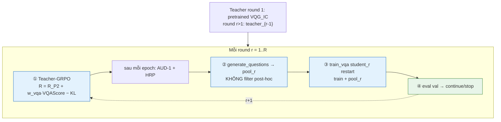

# Thiết kế C-RT+ — C-RL + VQAScore trong reward (bản đơn giản)

- **Ngày**: 2026-06-04
- **Contribution**: Mở rộng **C-RL** (GRPO teacher, reward P2, audit/HRP, vòng iterative) bằng **một term reward mới: VQAScore** — không đổi luồng pipeline.
- **Branch**: `feat/iterative-seltda` (cùng C-RL)
- **Trạng thái**: Drafted — bản đơn giản hoá
- **Dependency**: `docs/superpowers/specs/2026-06-01-rl-teacher-grpo-design.md` (C-RL), `filtering/reward.py`, `filtering/audit.py`, `train_vqg_rl.py`
- **Quan hệ**: **Giữ nguyên 100% luồng C-RL**; chỉ sửa `compose_reward` (+ adapter VQAScore).

---

## 0. Tóm tắt

C-RL có reward P2 (ITM + grounding + learnability − KL − repetition; **tạm bỏ weak-type / TypeMatch**) và vòng:

`GRPO teacher → generate pool → train student (restart) → eval → next round`

**C-RT+** chỉ thêm **VQAScore** vào reward GRPO:

```
R = R_P2(Q, A, I) + w_vqa * VQAScore(I, Q, A)
```

- **VQAScore** (Lin ECCV 2024): P("yes" | I, *Does this figure show "{Q} {A}"? Please answer yes or no.*)
- **Model (quyết định)**: **Frozen off-the-shelf** `clip-flant5-xl` qua `t2v_metrics` (`zhiqiulin/clip-flant5-xl`) — **không** tự fine-tune judge; **không** BLIP-VQA cho VQAScore — xem §2.2.1.
- **Không** thêm: D-step GAN, train 2 BLIP critics, VLM rationale warm-start, thay P2 bằng 2-term only, filter post-hoc, tune judge nhỏ.

**Thay đổi code tối thiểu**: `filtering/reward.py` (`score_vqascore` + `w_vqa`), `train_vqg_rl.py` gọi term mới; config `w_vqa`.

---

## 1. Pipeline (giữ luồng C-RL)



**Không đổi so với C-RL:**

| Bước | C-RL | C-RT+ |
|------|------|-------|
| Teacher init round r | tích luỹ từ teacher_{r-1} | giữ nguyên |
| Student | restart pretrained mỗi round | giữ nguyên |
| teacher_ref / KL neo gốc | giữ nguyên | giữ nguyên |
| Generate / filter | không filter post-hoc | giữ nguyên |
| Audit / HRP | epoch + round | giữ nguyên |

**Chỉ đổi:** công thức reward trong bước ①.

---

## 2. Reward

### 2.1 R_P2 (C-RL §2.2, **không weak-type**)

```
R_P2 = w_itm·ITM + w_grounding·Grounding + w_learnability·Learnability
     − w_kl·KL − w_repetition·Rep
```

- **Tạm bỏ** `w_type·TypeMatch` (WT-1 / `WEAK_TYPES`): không chạy Bước 0 eval → weak-types; config `w_type: 0`.
- Tái dùng `filtering/reward.py::compose_reward` (`type_match` luôn trả 0 khi `w_type=0`).

### 2.2 VQAScore (term mới)

```
VQAScore(I,Q,A) = P("yes" | I, Q_template)
```

- `Q_template`: *Does this figure show "{question} {answer}"? Please answer yes or no.*
- **Implement**: `filtering/reward.py::score_vqascore(...)` qua adapter bọc `t2v_metrics.VQAScore` (khuyến nghị), không rank yes/no trên BLIP-VQA.

#### 2.2.1 Vì sao **không** dùng BLIP-VQA SelTDA làm VQAScore

| | BLIP-VQA (SelTDA / `checkpoint_09`) | VQAScore paper (CLIP-FlanT5) |
|--|-------------------------------------|------------------------------|
| Mục tiêu train | Trả lời VQA (rank/cls trên answer vocab, VQAv2/A-OKVQA) | Metric: P(yes) cho câu *ảnh có thể hiện mô tả không* |
| Encoder | BLIP ViT + MED (uni-directional) | CLIP-L + **FlanT5** (bidirectional image↔question) |
| Yes/no compositional | Không train cho template verification | Fine-tune Stage-2 VQA cho GenAI-Bench / alignment |
| C-RL audit hiện tại | `answer_question(Q)` + match `A` ≈ **xcons**, không phải VQAScore | Đúng định nghĩa Lin et al. |

`cache/judges/blip_vqa_published.pth` vẫn hợp lý cho **AUD-1** (judge độc lập kiểu “student trả lời Q có khớp A không”), nhưng **không** thay thế VQAScore trong reward nếu muốn bám paper.

#### 2.2.2 Model khuyến nghị (local, không API)

Thứ tự ưu tiên (theo [t2v_metrics](https://github.com/linzhiqiu/t2v_metrics) + [Model Zoo](https://github.com/linzhiqiu/CLIP-FlanT5/blob/master/docs/MODEL_ZOO.md)):

| Ưu tiên | `model=` trong `t2v_metrics` | HF | VRAM (ước) | Ghi chú |
|--------|-------------------------------|-----|------------|---------|
| **1 (mặc định)** | `clip-flant5-xl` | `zhiqiulin/clip-flant5-xl` | ~12–16 GB | Cân bằng chất lượng / GRPO nhiều forward |
| **2 (tối đa chất lượng)** | `clip-flant5-xxl` | `zhiqiulin/clip-flant5-xxl` | ~40 GB | Paper khuyến nghị; chậm hơn |
| **3 (nhẹ hơn)** | `instructblip-flant5-xl` | (qua t2v_metrics) | ~12 GB | Cùng họ FlanT5, hỗ trợ sẵn trong lib |
| **4 (rất nhẹ)** | `paligemma-3b-mix-448` | (qua t2v_metrics) | ~8 GB | Kém hơn trên compositional; ablation only |

```python
import t2v_metrics
scorer = t2v_metrics.VQAScore(model="clip-flant5-xl")
text = f'{question} {answer}'  # hoặc full template theo constants.py
score = float(scorer(images=[path], texts=[text])[0])
```

**Tách vai trò (tránh circular):**

| Thành phần | Model |
|------------|--------|
| P2 learnability | `student_base` BLIP-VQA (như C-RL) |
| P2 ITM | OpenCLIP / BLIP ITM trong repo |
| **Reward VQAScore** | CLIP-FlanT5-xl (frozen, dep riêng) |
| AUD-1 (epoch) | ITM-large + (giữ BLIP-VQA published **hoặc** đổi sang cùng CLIP-FlanT5-xl cho nhất quán) |

**Phụ thuộc mới (optional extra):** `pip install t2v-metrics` (+ ffmpeg; lần đầu tải HF). Không gắn vào `environment.yaml` BLIP nếu conflict — module `filtering/vqascore_adapter.py` import lazy.

**Config phác thảo:**

```yaml
reward:
  vqascore_backend: t2v_metrics      # t2v_metrics | none
  vqascore_model: clip-flant5-xl
  w_vqa: 0.5
```

### 2.3 Tổng hợp

```
R_total = R_P2 + w_vqa * VQAScore
```

GRPO: `advantage = (R_total − mean_G) / (std_G + eps)` — giữ nguyên C-RL.

**Chi phí thêm:** ~1 forward BLIP-VQA / completion (batch G được); ITM/grounding/learnability P2 vẫn như cũ.

---

## 3. Vì sao thêm VQAScore (không thay P2)

| Signal | P2 đã có | VQAScore thêm |
|--------|----------|----------------|
| Image–text match | ITM (CLIP-style) | Alignment **compositional** (Q+A cùng lúc qua VQA encoder) |
| Đúng / grounded | Grounding (xcons×LP) | Hỏi trực tiếp "ảnh có support QA không?" |
| Khó (student bất định) | Learnability | Không trùng — bổ sung |

ITM trong P2 ≈ CLIPScore; VQAScore bắt composition tốt hơn (paper Lin 2024) — lý do thêm term, không bỏ P2.

---

## 4. Audit (không đổi)

- Epoch: ITM-Large + VQA judge độc lập (`audit.py`) — phát hiện hacking reward.
- Round: student val acc — continue/stop.
- Nếu `mean_reward`↑ nhưng `mean_judge`↓ → HRP L1–L3 (C-RL §6).

---

## 5. Config (phác thảo — thêm vào `configs/rl_teacher_aokvqa.yaml`)

```yaml
reward:
  w_type: 0                      # TẠM BỎ weak-type / TypeMatch
  w_itm: 0.5
  w_grounding: 1.0
  w_learnability: 0.5
  w_kl: 0.1
  w_repetition: 0.3
  w_vqa: 0.5                     # NEW — VQAScore (CLIP-FlanT5, không BLIP-VQA)
  vqascore_backend: t2v_metrics
  vqascore_model: clip-flant5-xl
  vqascore_device: cuda
  # AUD-1 vẫn có thể dùng audit.vqa_judge_ckpt (BLIP-VQA) — tách khỏi reward

weak_types: null                  # không dùng — bỏ WT-1
```

**Ablation bắt buộc:** `w_vqa=0` (C-RL thuần) vs `w_vqa>0` (C-RT+).

---

## 6. Code thay đổi (tối thiểu)

```
filtering/vqascore_adapter.py  # NEW — lazy wrap t2v_metrics.VQAScore
filtering/reward.py          # + score_vqascore → adapter
train_vqg_rl.py              # gọi R_total khi tính reward step
configs/rl_teacher_aokvqa.yaml
tests/test_vqascore_reward.py
```

**Không** sửa: `train_vqa.py`, `generate_questions.py` (format Q,A như cũ), `filter_pseudo.py`, orchestrator logic.

---

## 7. Out of scope (bản đơn giản)

- **WT-1 weak-type freezing** (`orchestration/weak_types.py`, `w_type > 0`) — tạm bỏ; bật lại sau nếu cần
- Dual-BLIP GAN / train D_clip + D_vqa (doc cũ / C-AF)
- Rationale / CoT / VLM warm-start
- Thay P2 bằng chỉ CLIP + VQA
- Filter post-hoc sau generate

---

## 8. Success criteria

| So sánh | Target |
|---------|--------|
| C-RT+ vs C-RL (`w_vqa=0`) | **≥ +0.5** val overall (hoặc ≥ +1.0 nếu đủ compute) |
| Hacking | reward↑ + judge↓ không tăng (AUD-1) |

---

## 9. References

- C-RL: `docs/superpowers/specs/2026-06-01-rl-teacher-grpo-design.md`
- VQAScore: Lin et al. ECCV 2024 — https://linzhiqiu.github.io/papers/vqascore/
- SelTDA gates (ITM / conf / xcons): `docs/superpowers/specs/2026-05-21-pseudo-label-filtering-design.md`
