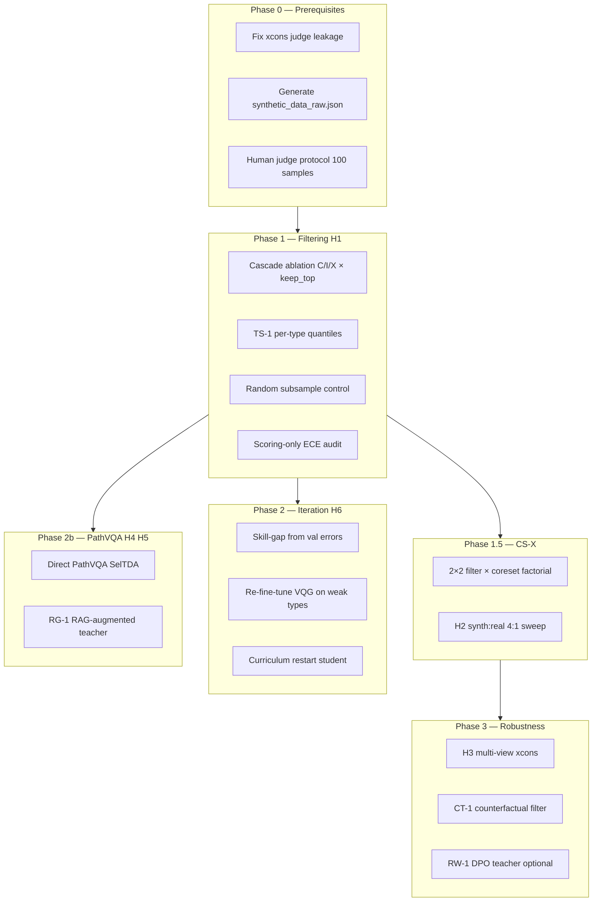

# Integrated Thesis Plan — SelTDA Improvements

- **Date**: 2026-05-26
- **Synthesis agents**: research_architect + synthesis (deep-research Phase 1 + 3)
- **Status**: Planning complete; experiments pending compute

---

## Research question (final)

**Primary RQ**: How can pseudo-label quality control — via filtering, diversity selection, iterative feedback, and domain-aware generation — extend SelTDA to exceed its published A-OKVQA and PathVQA baselines without modifying the student training codebase?

**Sub-questions**:

1. At what filter operating point does student accuracy peak, and does filtering shift the optimal synthetic:real ratio above 2:1?
2. Does coreset selection add gain beyond quality filtering at matched sample counts?
3. Do iterative student-feedback rounds compound gains, and when do they saturate?
4. Does RAG-augmented generation fix the medical-vocabulary failure mode on PathVQA direct training?

---

## Methodology blueprint

| Dimension | Choice | Rationale |
|-----------|--------|-----------|
| **Paradigm** | Pragmatist — ablation-driven empirical ML | Matches SelTDA paper style; reviewer expectations at CVPR-tier venues |
| **Method** | Mixed: quantitative ablations + 100-sample human judge qualitative | Khan 2023 used manual eval n=100; replicate for filter precision/recall |
| **Data** | Secondary: COCO unlabeled, A-OKVQA train/val, PathVQA, published synthetic JSONs | `dataset.sh` + `convert_aokvqa.py` |
| **Baselines** | BLIP no-synth (57.11), SelTDA unfiltered (60.01), **random subsample at matched N** | Fair comparison + missing baseline from brainstorm F7 |
| **Metrics** | A-OKVQA val acc (primary), PathVQA test (secondary), filter P/R vs human judge, ECE (tertiary) | Spec §5.4 anticipates P/R correlation |
| **Validity** | 3 seeds, hold synth:real constant unless testing H2, fix xcons judge to pretrained-only | xcons leakage blocker documented |
| **Ethics** | No human subjects for main pipeline; human judge subset needs annotator agreement report | AI disclosure in thesis |

### Hard constraint (§1.4)

Only modify: `generate_questions.py`, `filter_pseudo.py`, `filtering/*`, orchestration scripts, filter configs. **Never** modify `train_vqa.py`, `train_vqg.py`, `data/`, `models/` (except scoped `blip.py`), eval tools.

Soft-weighting → **duplicate-sampling** by filter score, not loss reweighting.

---

## Phase architecture

---

## Hypothesis → experiment map

| Hypothesis | Experiment | Success criterion | Falsifier |
|------------|------------|-------------------|-----------|
| **H1** | H1 protocol 8 variants × 3 seeds | Best ≥ 61.5 val (+1.5 vs 60.01) | No variant beats unfiltered by ≥0.5 |
| **H2** | Filtered 4:1 synth:real | ≥ 63.0 val | Filtered 4:1 ≤ unfiltered 2:1 |
| **H3** | 3-view augmentation xcons | P/R +10 vs single-view on judge set | No P/R improvement |
| **H4** | PathVQA direct train + filter | Test ≥ 38% | ≤ 30% |
| **H5** | + RAG teacher on PathVQA | +4 pts vs filtered-only PathVQA | < +2 pts |
| **H6** | 3-round IT-1 | Round-3 ≥ Round-1 + 2.0 val | Saturation by round 2 |
| **H7** | Type-conditioned generation | EK/VR +5 each | Overall regression > 0.5 |

---

## Compute budget (estimate)

| Block | GPU-hours (A5000) | Notes |
|-------|-------------------|-------|
| H1 full matrix | ~260 | From protocol.md |
| CS-X embedding + select | ~5 | One-time |
| H2 ratio sweep | ~40 | Subset of H1 |
| IT-1 × 3 rounds | ~400 | 3× full train cycles |
| PathVQA branch | ~120 | Smaller dataset |
| **Total (core thesis)** | **~825** | ~$400–500 Vast.ai @ $0.50/hr |

Mitigation: sequential testing — stop early if H1 falsified on seed 1.

---

## Knowledge gaps → paper sections

| Gap | Section |
|-----|---------|
| Filter P/R ↔ student acc correlation | Results §4.1 + Discussion |
| Optimal synth:real under filtering | Results §4.2 (H2) |
| Confirmation bias across IT-1 rounds | Results §5 + Limitations |
| Medical RAG failure modes | PathVQA chapter §6 |
| Reward hacking in RW-1 | Appendix (even if negative) |

---

## Devil's advocate checkpoint (Phase 1 scoping)

| Challenge | Response |
|-----------|----------|
| "Filtering is incremental" | CS-X + IT-1 + PathVQA direct + characterization of saturation/ratios = multi-faceted |
| "xcons is just cycle-consistency — known" | Type-stratified + coreset + multi-view + iterative closure = novel combination for VQA self-training |
| "PathVQA numbers won't beat LLaVA-Med" | Thesis claims **closing SelTDA gap**, not SOTA medical VLM |
| "H1 might fail" | Pre-registered falsifier → pivot to H3/H6; still publishable negative result |
| "§1.4 prevents soft labels" | Duplicate-sampling is principled workaround; document in methods |

**Verdict**: PASS — proceed to experiments after xcons fix.

---

## File index (research folder)

| Path | Purpose |
|------|---------|
| `research/findings.md` | Living project memory |
| `research/research-state.yaml` | Machine-readable state |
| `research/research-log.md` | Append-only chronology |
| `research/literature/` | Verified literature deep-dives |
| `research/ideation/` | Brainstorm + convergence |
| `research/synthesis/` | This plan |
| `research/experiments/H1-cascade-filter/` | Locked H1 protocol |
| `docs/reports/2026-05-26-deep-research-seltda-improvements.md` | Full APA-style survey |

---

## AI disclosure

This plan was drafted with AI-assisted literature search and synthesis. All experimental claims require GPU execution before publication.
