# Báo cáo chọn lọc Ideas — SelTDA Improvements

- **Ngày**: 2026-05-27
- **Nguồn phân tích**: `research/ideation/` (7 file, ~38 ideas đặt tên)
- **Ràng buộc tham chiếu**: §1.4 (chỉ sửa generation / filtering / orchestration); thesis dùng **A-OKVQA + PathVQA** làm trục chính
- **Mục tiêu báo cáo**: Chọn các hướng **phù hợp, khả thi, có tiềm năng cải tiến rõ** — **loại** các hướng chỉ có giá trị trên một dataset

---

## 1. Tiêu chí chọn lọc

| Tiêu chí | Mô tả | Trọng số |
|----------|--------|----------|
| **Tính tổng quát** | Cơ chế áp dụng được trên ≥2 benchmark hoặc không phụ thuộc domain cụ thể | Bắt buộc |
| **Khả thi (§1.4)** | Không cần sửa `train_vqa.py` / loss; orchestration hoặc duplicate-sampling được chấp nhận | Cao |
| **Bằng chứng literature** | Có paper tương đương đã verify (Khan 2023, JointMatch, ZCore, DataEnvGym, …) | Cao |
| **Impact dự kiến** | Gain ≥+1 điểm val hoặc cải thiện P/R filter / robustness đo được | Cao |
| **Effort / compute** | Có thể chạy trên ~1 GPU A5000 trong budget thesis (~825 GPU-h core) | Trung bình |
| **Đóng góp luận văn** | Tạo được narrative chapter rõ, không chỉ appendix | Trung bình |

**Tiêu chí loại (hard reject)**:
- Chỉ có lý do tồn tại trên **một dataset** (vd. gate bật `dataset=pathvqa`, metric reporting chỉ cho PathVQA, curriculum yes/no vs free-form chỉ medical).
- Không có baseline bắt buộc (filter không so với random-subsample cùng N).
- Phụ thuộc API không reproducible (GPT-4V judge full pool).
- Scope explosion (multi-task 4 dataset × filter × iteration).

---

## 2. Tóm tắt điều hành

Trong **38 ideas** (IDEA-01 → IDEA-38), sau lọc còn **12 ideas chính** + **4 ideas phụ** (appendix / conditional).

**Ba trụ contribution đề xuất** (không phụ thuộc một dataset):

1. **Filtering có cấu trúc** — cascade + ngưỡng theo question type + coreset + saturation curve.
2. **Vòng lặp & curriculum** — iterative SelTDA theo skill-gap + staged easy/hard pool.
3. **Generation & gate mở rộng** — two-stage VQG, type-conditioned generation, language-prior / knowledge gates, counterfactual robustness.

PathVQA vẫn là **benchmark validation** (chạy cùng pipeline đã chọn), không phải **đối tượng thiết kế riêng** của từng idea.

---

## 3. Ideas được chọn — Tier A (chạy ngay, core thesis)

### A1. CF-1 + IDEA-04 — Cascade Filter + Random-Subsample Control

| | |
|---|---|
| **ID** | IDEA-01, IDEA-04 |
| **Vấn đề** | ~30% pseudo-QA sai (Khan Tab.3); filter chưa được chứng minh trên distribution thực |
| **Cơ chế** | `conf → ITM → xcons` cascade; control bắt buộc: random N sample cùng kích thước |
| **Tại sao chọn** | Nền tảng mọi claim filter; đã có spec H1 + code `filtering/gates.py`; áp dụng **A-OKVQA và PathVQA** cùng pipeline |
| **Khả thi** | ★★★★★ — đã implement, chỉ cần `synthetic_data_raw.json` + GPU |
| **Impact dự kiến** | +1.5 → +3 điểm A-OKVQA val; PathVQA tương đương tỷ lệ nếu train direct |
| **Rủi ro** | Nếu ≤ random-subsample → toàn bộ nhánh filter falsified (cần pivot, không waste thêm compute) |

---

### A2. TS-1 — Type-Stratified Filter

| | |
|---|---|
| **ID** | IDEA-02 |
| **Vấn đề** | Một ngưỡng global bất công giữa yes/no (cần strict) và open-ended / EK (cần lenient) |
| **Cơ chế** | Quantile **per question-type stratum** (JointMatch-style); giữ tổng N cố định theo tỷ lệ val |
| **Tại sao chọn** | Question type là khái niệm **cross-dataset** (A-OKVQA categories, PathVQA closed/open); cheap config flag |
| **Khả thi** | ★★★★★ — bundle với H1, ~0 GPU thêm (chỉ re-filter) |
| **Impact dự kiến** | EK/VR +3–5 điểm **per-type** mà không regression tổng |
| **Kết hợp** | CF-1 + TS-1 = variant mặc định trước khi thêm CS-X |

---

### A3. CS-X — Coreset-Stratified Filter

| | |
|---|---|
| **ID** | IDEA-03 |
| **Vấn đề** | Filter confidence giữ nhiều near-duplicate → lãng phí budget synthetic |
| **Cơ chế** | ZCore trên embedding CLIP/DINOv2, **trong từng stratum** sau quality gate |
| **Tại sao chọn** | "Quality × diversity" là contribution độc lập, không gắn domain; 2×2 factorial với filter |
| **Khả thi** | ★★★★☆ — port ZCore ~5 GPU-h embedding one-time |
| **Impact dự kiến** | Cùng N kept, ≥+1 điểm vs filter-only; enable H2 (ratio cao hơn 2:1) |
| **Thứ tự** | Phase 1.5 — **sau** khi H1 có winner |

---

### A4. SAT-1 / SSR-1 — Saturation Curve Characterization

| | |
|---|---|
| **ID** | IDEA-27, IDEA-38 |
| **Vấn đề** | Khan Tab.4: synth:real > 2:1 làm accuracy giảm — chưa biết filter có **dịch điểm bão hòa** không |
| **Cơ chế** | Grid `synth:real ∈ {1:1, 2:1, 4:1, 8:1}` × `{unfiltered, filtered, CS-X}` |
| **Tại sao chọn** | Đóng góp **lý thuyết cơ chế** (noise saturation), không phụ thuộc dataset; reviewer Khan 2023 quan tâm |
| **Khả thi** | ★★★★☆ — subset re-train (~40 GPU-h theo thesis plan) |
| **Impact dự kiến** | Có thể không tăng peak nhiều nhưng **giải thích được** khi nào "more data hurts" |

---

## 4. Ideas được chọn — Tier B (chapter mạnh nếu Tier A thành công)

### B1. IT-1 / DE-1 — Iterative SelTDA (Skill-Tree Loop)

| | |
|---|---|
| **ID** | IDEA-17, IDEA-33 |
| **Vấn đề** | Một vòng self-training — student yếu ở skill X nhưng teacher không biết |
| **Cơ chế** | Val error per type → re-fine-tune VQG trên weak types → regenerate → filter → student v2; **restart weights** mỗi round (Cascante-Bonilla) |
| **Tại sao chọn** | DataEnvGym (cùng tác giả Khan) đã chứng minh iterative teaching; skill buckets generalize sang mọi VQA có category |
| **Khả thi** | ★★★☆☆ — ~400 GPU-h (3 rounds); §1.4 OK qua orchestration script |
| **Impact dự kiến** | Round 3 ≥ Round 1 + 2.0 val (H6); diminishing returns round 3 |
| **Validation cross-domain** | Chạy 2 round trên A-OKVQA (primary); 1 round PathVQA để kiểm tra transfer cơ chế |

---

### B2. J-1 — Staged Pool Curriculum

| | |
|---|---|
| **ID** | IDEA-18 |
| **Vấn đề** | Strict filter ↓ quantity vs curriculum cần easy→hard |
| **Cơ chế** | Hai pool JSON: `synthetic_easy` (keep_top=0.9) + `synthetic_hard` (full C+I+X @ 0.75); duplicate-sampling easy×1, hard×3 |
| **Tại sao chọn** | Orchestration thuần §1.4; curriculum là pattern **domain-agnostic** |
| **Khả thi** | ★★★★☆ — 2 lần filter + merge config |
| **Impact dự kiến** | +0.5–1 final acc; convergence nhanh hơn |
| **Kết hợp** | Compose với IT-1 (easy pool round 1, hard pool round 2+) |

---

### B3. TC-1 (IDEA-13) — Type-Conditioned Generation

| | |
|---|---|
| **ID** | IDEA-13 |
| **Vấn đề** | Sunburst Khan Fig.6 — quá nhiều "how many", thiếu EK/VR |
| **Cơ chế** | Prompt `[TYPE=external_knowledge]` + oversample underrepresented types đến khi match val distribution |
| **Tại sao chọn** | Fix **generation bias** (upstream), complement TS-1 (downstream); type taxonomy portable |
| **Khả thi** | ★★★★☆ — sửa `generate_questions.py` + schedule |
| **Impact dự kiến** | Per-type EK/VR +5; tổng +1–2 |
| **Lưu ý** | Cần map type schema A-OKVQA ↔ PathVQA (closed vs open) khi validate chéo |

---

### B4. PV-1 / BARE — Two-Stage VQG (Q rồi A)

| | |
|---|---|
| **ID** | IDEA-11 |
| **Vấn đề** | Sinh (Q,A) jointly — lỗi Q và A entangle, khó filter |
| **Cơ chế** | Stage 1: diverse Q từ image; Stage 2: A conditional trên (I,Q); filter Q và A **độc lập** |
| **Tại sao chọn** | Decomposition generation **general** — không medical-specific; giải quyết root cause Tab.3 |
| **Khả thi** | ★★★★☆ — 2× decode latency one-time generation |
| **Impact dự kián** | Manual eval answer-correctness +5–10% absolute |
| **Thứ tự** | Chạy nếu CF-1+TS-1 gain < +1.0 (generation là bottleneck) |

---

## 5. Ideas được chọn — Tier C (differentiation / robustness)

### C1. LP-1 — ViLP Language-Prior Gate

| | |
|---|---|
| **ID** | IDEA-05 |
| **Vấn đề** | Pseudo-QA đúng nhờ text prior, không dạy visual grounding |
| **Cơ chế** | Gate thứ 4: corrupt ảnh → nếu student vẫn trả A → drop |
| **Tại sao chọn** | Eval trên **AdVQA, VQA-CE, A-OKVQA** — đúng Limitation #3 Khan; không PathVQA-only |
| **Khả thi** | ★★★☆☆ — 3× student forward khi score; chỉ thêm scorer |
| **Impact dự kiến** | AdVQA/VQA-CE +2–5; A-OKVQA +0.5–1 |

---

### C2. KC-1 — Knowledge-Consistency Gate

| | |
|---|---|
| **ID** | IDEA-30 (trùng tên KC-1 catalog gốc IDEA-14 — dùng bản gate kcons) |
| **Vấn đề** | EK pseudo-QA sai do factual hallucination, không phải visual mismatch |
| **Cơ chế** | Retrieve Wikipedia/ConceptNet → NLI entailment cho (Q,A) |
| **Tại sao chọn** | EK là slice lớn trên A-OKVQA (~40%); cơ chế retrieval+verify **portable** sang PathVQA (PubMed thay Wiki) mà không thiết kế riêng medical branch |
| **Khả thi** | ★★★☆☆ — module `score_knowledge_consistency`; API latency |
| **Impact dự kiến** | EK stratum +4–8; tổng +1–2 |
| **Ablation** | kcons alone vs itm alone trên EK subset |

---

### C3. CT-1 — Counterfactual Filter / Augmentation

| | |
|---|---|
| **ID** | IDEA-24 |
| **Vấn đề** | Self-training khuếch đại language shortcut; AdVQA chỉ +6.37 |
| **Cơ chế** | Sinh I' (remove object / swap attribute); drop nếu student vẫn trả A trên I' |
| **Tại sao chọn** | Robustness benchmark **đa domain** (AdVQA, VQA-CE); align Limitation #3 |
| **Khả thi** | ★★★☆☆ — LaMa inpainting hoặc crop-remove lightweight |
| **Impact dự kián** | AdVQA +3–5; VQA-CE +5–10 |
| **Thứ tự** | Phase 3 — sau filter core ổn định |

---

### C4. SS-1 — SemIAug ⊕ SelTDA Composition

| | |
|---|---|
| **ID** | IDEA-31 |
| **Vấn đề** | SemIAug (+1.4% A-OKVQA) và SelTDA là hai trục độc lập |
| **Cơ chế** | `train_files = [SemIAug(real), filtered_synthetic]` |
| **Tại sao chọn** | Compose orthogonal methods → baseline mạnh; preprocessing ngoài §1.4 |
| **Khả thi** | ★★★★★ — script preprocessing, không sửa train |
| **Impact dự kiến** | Additive +1.0 → +2.5 trên filtered SelTDA |
| **Vai trò** | Tier T3 trong baseline bundle (CB-1) |

---

## 6. Ideas phụ — Tier D (appendix / conditional)

| ID | Tên | Khi nào chạy | Lý do giữ |
|----|-----|--------------|-----------|
| IDEA-07 | RQ-1 Reverse Question Cycle | CF-1 yếu trên VR/EK | Gate bổ sung, §1.4 OK; +30% teacher forward |
| IDEA-06 | CR-1 CycleReward | Sau LP-1 | Filter precision +10% judge; compute cao hơn LP-1 |
| IDEA-28 | NS-1 NovelSum Diversity | Báo cáo paper | Metric diversity pool — không tăng acc trực tiếp |
| CB-1 / MCR-1 (partial) | Baseline + stratified metrics | Luôn | Credibility reviewer; MCR-1 dùng cho **mọi** bảng PathVQA, không phải idea thí nghiệm |

**Không chọn làm experiment chính**: IDEA-10 SemiReward, IDEA-25 Maieutic, IDEA-26 RW-1 DPO (trừ khi Tier A–C plateau — RW-1 publishable negative result).

---

## 7. Ideas bị loại — và lý do

### 7.1 Loại vì chỉ focus một dataset

| ID | Tên | Lý do loại |
|----|-----|------------|
| **IDEA-21** | PathVQA Direct SelTDA | Contribution = "train trên PathVQA" — không generalize mechanism; **giữ làm eval branch**, không phải idea thiết kế |
| **IDEA-22** | RG-1 / MMed-RAG Teacher | Retrieval KB y tế (PubMed, pathology glossary) — **medical-only generation** |
| **IDEA-23** | MT-1 MedThink Rationale | Rationale + CheXpert tags — PathVQA-specific |
| **IDEA-34** | HAL-1 Medical Hallucination Gate | Config `dataset=pathvqa` only |
| **IDEA-35** | YF-1 Yes/No vs Free-Form Dual-Track | Curriculum tách theo PathVQA answer format imbalance |
| **IDEA-14** | SK-VQA Knowledge Context (catalog) | Thiết kế cho A-OKVQA EK slice; quá hẹp so với KC-1 gate generalized |

> **Ghi chú**: PathVQA vẫn được **đo kết quả** của pipeline Tier A–C (cùng filter, iteration, gates). Không loại PathVQA khỏi thesis — chỉ loại các **ideas có cơ chế chỉ có ý nghĩa trên một domain**.

### 7.2 Loại vì khả thi / scope / reproducibility

| ID | Tên | Lý do loại |
|----|-----|------------|
| IDEA-15 | Teacher Council | 3× generation cost; gain không vượt TS-1+CS-X đủ justify |
| IDEA-16 | SQ-LLaVA Self-Check | Thêm decode round; overlap LP-1 / RQ-1 |
| IDEA-12 | Q&A Prompts Visual Scaffolding | Florence/RAM dependency nặng; GROUND-1 tương tự đã defer |
| IDEA-20 | AL-1 Active Image Selection | Entropy proxy yếu evidence; defer convergence ranking |
| JUDGE-1 | GPT-4V Judge | API cost + non-reproducible cho main table |
| GROUND-1 | SAM-Grounded VQG | Heavy deps; marginal over ITM |
| MULTI-1 | Multi-Task SelTDA | 4 datasets × scope explosion |
| PROV-1 | Provenance Hashing | Engineering, không impact accuracy |
| PAC-1 | PAC-style Bounds | Theory appendix — không priority GPU |
| EB-1 | Energy-Based Filter | Chỉ nếu H1 fail hoàn toàn |
| DIFF-1 | Diffusion Counterfactual | Merge vào CT-1 |
| MC-1 | MCMC-SelTDA | Theory follow-up IT-1 — quá sớm |
| IDEA-32 | BLIP-Ceiling Teacher Scale | Ablation judge 200 sample — không cross-dataset story |
| IDEA-37 | NB-1 NaturalBench Probe | Metric phụ; BLIP-base adapter chưa rõ — defer |
| IDEA-08 | SM-1 ShrinkMatch Rescue | P3 appendix — rescue sample gần ngưỡng, incremental |
| IDEA-09 | PG-1 Prototype Filter | Overfit risk 17k A-OKVQA train |

---

## 8. Portfolio đề xuất — thứ tự thực thi

```mermaid
flowchart LR
    subgraph P0 [Prerequisites]
        A[synthetic_data_raw.json]
        B[xcons pretrained-only ✓]
    end

    subgraph P1 [Tier A — Filtering Core]
        C[CF-1 + TS-1 + random control]
        D[CS-X factorial]
        E[SAT-1 ratio sweep]
    end

    subgraph P2 [Tier B — Loop & Gen]
        F[TC-1 type gen]
        G[J-1 curriculum]
        H[IT-1 2-3 rounds]
        I[PV-1 if gen bottleneck]
    end

    subgraph P3 [Tier C — Robustness]
        J[LP-1 + KC-1 gates]
        K[CT-1 counterfactual]
        L[SS-1 + CB-1 baselines]
    end

    P0 --> P1 --> P2 --> P3
```

| Phase | Ideas | Benchmark chính | Benchmark phụ |
|-------|-------|-----------------|---------------|
| **1** | CF-1, TS-1, IDEA-04, CS-X, SAT-1 | A-OKVQA val | PathVQA test (filtered pipeline) |
| **2** | IT-1, J-1, TC-1, (PV-1) | A-OKVQA val per-type | PathVQA 1-round sanity |
| **3** | LP-1, KC-1, CT-1, SS-1 | A-OKVQA + AdVQA/VQA-CE | PathVQA nếu gate portable |

**Compute ước lượng (core selection)**: ~650–750 GPU-h (Tier A+B); +~120 nếu full Tier C.

---

## 9. Narrative luận văn (3 contributions)

> **C1 — Structured pseudo-label curation**: Cascade filtering với type-stratified thresholds và coreset selection nâng accuracy trên unfiltered SelTDA, đồng thời dịch điểm bão hòa synthetic:real (H1, H2, CS-X, SAT-1). Chứng minh trên A-OKVQA; replicate pipeline trên PathVQA.

> **C2 — Closed-loop self-training**: Vòng lặp skill-gap (IT-1) kết hợp staged curriculum (J-1) và type-conditioned generation (TC-1) cho compound gain vượt single-round SelTDA (H6, H7).

> **C3 — Grounding-aware quality control**: Gates language-prior (LP-1), knowledge-consistency (KC-1), và counterfactual verification (CT-1) giảm shortcut learning, cải thiện robustness benchmark đa domain.

SemIAug composition (SS-1) và baseline bundle (CB-1) đóng vai trò **experimental rigor**, không phải contribution thứ tư.

---

## 10. Ma trận tổng hợp ideas được chọn

| ID | Tên ngắn | Tier | Khả thi | Impact | Cross-dataset | Ưu tiên GPU |
|----|----------|------|---------|--------|---------------|-------------|
| 01+04 | CF-1 + random control | A | ★★★★★ | ★★★★☆ | ✓ | 1 |
| 02 | TS-1 | A | ★★★★★ | ★★★★☆ | ✓ | 1 |
| 03 | CS-X | A | ★★★★☆ | ★★★★☆ | ✓ | 2 |
| 27/38 | SAT-1 / SSR-1 | A | ★★★★☆ | ★★★☆☆ | ✓ | 2 |
| 17/33 | IT-1 / DE-1 | B | ★★★☆☆ | ★★★★★ | ✓ | 3 |
| 18 | J-1 curriculum | B | ★★★★☆ | ★★★☆☆ | ✓ | 3 |
| 13 | TC-1 type gen | B | ★★★★☆ | ★★★★☆ | ✓ | 3 |
| 11 | PV-1 two-stage VQG | B | ★★★★☆ | ★★★☆☆ | ✓ | 4 (conditional) |
| 05 | LP-1 language-prior | C | ★★★☆☆ | ★★★★☆ | ✓ | 4 |
| 30 | KC-1 knowledge gate | C | ★★★☆☆ | ★★★★☆ | ✓ | 4 |
| 24 | CT-1 counterfactual | C | ★★★☆☆ | ★★★★☆ | ✓ | 5 |
| 31 | SS-1 SemIAug compose | C | ★★★★★ | ★★★☆☆ | ✓ (A-OKVQA primary) | 5 |

---

## 11. Quyết định cần xác nhận (human)

1. **PathVQA trong thesis**: Chấp nhận chỉ **replicate pipeline** (filtered SelTQA direct train) thay vì medical-specific ideas (RG-1, HAL-1) — có đủ cho chapter domain không?
2. **IT-1 scope**: 3 round full (~400 GPU-h) hay 2 round + early stop nếu round 2 gain < 0.5?
3. **Tier C**: LP-1 vs KC-1 — chạy cả hai (4-gate cascade dài) hay chọn một theo ablation EK slice?
4. **RW-1 DPO**: Có reserve ~80 GPU-h cho negative-result appendix không?

---

## 12. Tài liệu tham chiếu nội bộ

| File | Nội dung |
|------|----------|
| `ideation/2026-05-26-extended-ideas-catalog.md` | 28 ideas chi tiết IDEA-01→28 |
| `ideation/2026-05-26-sota-informed-ideas.md` | IDEA-29→38 |
| `ideation/2026-05-26-convergence-ranking.md` | Scorecard 14 candidates, tier assignments |
| `synthesis/2026-05-26-integrated-thesis-plan.md` | Phase architecture, hypothesis map |
| `experiments/H1-cascade-filter/protocol.md` | H1 ablation matrix locked |

---

*Báo cáo assisted by AI; lựa chọn dựa trên tiêu chí user (cross-dataset, khả thi §1.4) và convergence ranking nội bộ 2026-05-26.*
